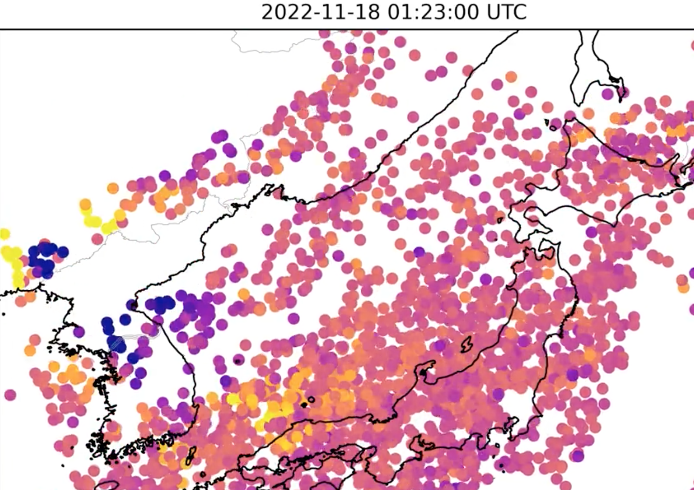

---
# title for above
title: "Detecting Misile Launch Ionosphere"
date: 2023-01-29T15:32:46+01:00
draft: false
rating: 4
identifyer:
  - isbn/doi
  - url
RSS:
  - url: http://traffic.libsyn.com/armscontrolwonk/212.mp3?dest-id=228079
  - title: Detecting Missile Launches with Ionospheric Disturbances
  - link: https://www.armscontrolwonk.com/archive/1216884/detecting-missile-launches-with-ionospheric-disturbances/
# full title of resource
link_title: "Detecting Missile Launches with Ionospheric Disturbances"
pubDate: "20 December 2022"
authors:
  - Tyler Nighswander
  - Mike Nute
  - Jeffrey Lewis
  - Aaron Stein
difficulties:
  - advanced
linktypes:
    - blogpost
    - podcastepisode
tags:
    - data engineering
---

## Detecting Misile Launches in the Ionosphere

This is bananas. Not really data science, but slightly data engineering related.
There were papers showing you should be able to detect missile launches but these
two people actually did it. Interesting to hear the data engineering aspects of it.

> Tyler Nighswander and Mike Nute have developed an incredible tool for detecting long-range missile and space launches by processing and visualizing ionospheric disturbances in GPS data. 

[armscontrolwonk Podcastepisode with authors .](https://armscontrolwonk.libsyn.com/detecting-missile-launches-with-ionospheric-disturbances)
or this [page](https://www.armscontrolwonk.com/archive/1216884/detecting-missile-launches-with-ionospheric-disturbances/).

Tweet with images of poc [twitter tylerni7](https://twitter.com/tylerni7/status/1593453980382007296)

Github repo [tylerni7/missile-tid](https://github.com/tylerni7/missile-tid)

